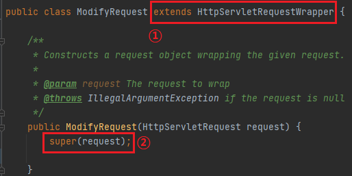
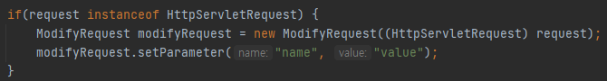

## HttpServletRequest 파라미터 추가
SpringBoot 필터 예제를 작성하다 파라미터를 변경해야 하나 setParameter() 함수가 별도로 없어서 방법을 찾던 중  
HttpServletRequestWrapper 클래스를 상속받아 HttpServletRequest를 복사하는 방법을 찾았다.
   

1.HttpServletRequestWrapper 상속 (ModifyRequest 클래스)

> 

위 사진에서  ①  과 같이 상속 후,
 ②  처럼 생성자에서 부모 클래스의 생성자를 호출하면 된다.
   

2.ModifyRequest 사용
> 
   

참고 사이트 : https://sunghs.tistory.com/64

나의 소스 : https://bit.ly/3uSGt7K
