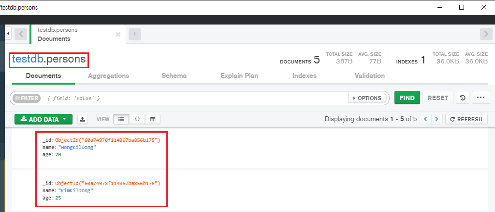

## SpringBoot + MongoDB 연동 예제
MongoDB가 설치 과정은 생략하고 SpringBoot에서 설정 후  
MongoTemplate, MongoRepository 두 가지 방법을 통해 사용하는 간략한 방법을 설명하겠습니다.
  

### 예제 DB 초기 상태
  
persons 이름의 Documents에 2개의 값이 들어있는 상태
  

### Dependency 설정
> ex) build.gradle
~~~gradle
dependencies {
    implementation 'org.springframework.boot:spring-boot-starter-data-mongodb'
}
~~~
spring-boot-starter-data-mongodb 추가
  

### yml 설정
> ex) application.yml
~~~yml
spring:
  data:
    mongodb:
      host: localhost
      port: 27017
      database: testdb
~~~
host, port, database 이름만으로 설정은 끝입니다.
  

### Document, Repository, Service 클래스 생성
> ex) PersonDoc.java
~~~java
@Document("persons")
@Data
public class PersonDoc {
    @Id
    private String _id;
    private String name;
    private int age;
}
~~~
@Document 어노테이션에 Documents 이름을 지정해 줍니다.
  

> ex) PersonRepository.java
~~~java
public interface PersonRepository extends MongoRepository<PersonDoc, String> {
    List<PersonDoc> findByAge(int age);
}
~~~
  

> ex) PersonService.java
~~~java
@Service
public class PersonService {

    @Autowired
    private MongoTemplate mongoTemplate;

    @Autowired
    private PersonRepository personRepository;

    public PersonDoc getPerson(String _id){
        PersonDoc personDoc = mongoTemplate.findById(_id,PersonDoc.class);
        return Optional.ofNullable(personDoc).orElseThrow(() -> new RestClientException(HttpStatus.NOT_FOUND.toString()));
    }

    public List<PersonDoc> getPersonList(int age){
        Query query = new Query().addCriteria(Criteria.where("age").is(age));
        return mongoTemplate.find(query, PersonDoc.class);
    }

    public PersonDoc insertPerson(PersonDoc personDoc){
        return mongoTemplate.insert(personDoc);
    }

    public PersonDoc getPersonByRepo(String _id){
        return personRepository.findById(_id).orElseThrow(() -> new RestClientException(HttpStatus.NOT_FOUND.toString()));
    }

    public List<PersonDoc> getPersonListByRepo(int age){
        return personRepository.findByAge(age);
    }

    public PersonDoc insertPersonByRepo(PersonDoc personDoc){
        return personRepository.insert(personDoc);
    }
}
~~~
getPerson(), getPersonList(), insertPerson()는 MongoTemplate를 이용한 방법,  
xxxByRepo()는 MongoRepository를 이용한 방법입니다.  
  

### 테스트 코드
~~~java
@SpringBootTest
public class PersonTests {
    Logger logger = LoggerFactory.getLogger(PersonTests.class);

    @Autowired
    PersonService personService;

    @Test
    public void testSelectPerson(){
        String _id = "60a74970f114367ba856b175";
        PersonDoc personDoc = personService.getPerson(_id);
        assertEquals("HongKilDong", personDoc.getName());
    }

    @Test
    public void testSelectPersonList(){
        int age = 25;
        int expected = 2;

        List<PersonDoc> personDocList = personService.getPersonList(age);

        for(PersonDoc personDoc : personDocList){
            logger.info(personDoc.get_id() + " " + personDoc.getName() + " " + personDoc.getAge());
        }

        assertEquals(expected, personDocList.size());
    }

    @Test
    public void testInsertPerson(){
        PersonDoc personDoc = new PersonDoc();
        personDoc.setAge(21);
        personDoc.setName("KangKilDong");

        PersonDoc result = personService.insertPerson(personDoc);
        logger.info("result :: " + result.get_id() + " " + result.getName() + " " + result.getAge());
    }

    @Test
    public void testSelectPersonByRepo(){
        String _id = "60a74970f114367ba856b175";
        PersonDoc personDoc = personService.getPersonByRepo(_id);
        assertEquals("HongKilDong", personDoc.getName());
    }

    @Test
    public void testSelectPersonListByRepo(){
        int age = 25;
        int expected = 2;

        List<PersonDoc> personDocList = personService.getPersonListByRepo(age);

        for(PersonDoc personDoc : personDocList){
            logger.info(personDoc.get_id() + " " + personDoc.getName() + " " + personDoc.getAge());
        }

        assertEquals(expected, personDocList.size());
    }

    @Test
    public void testInsertPersonByRepo(){
        PersonDoc personDoc = new PersonDoc();
        personDoc.setAge(22);
        personDoc.setName("LimKilDong");

        PersonDoc result = personService.insertPerson(personDoc);
        logger.info("result :: " + result.get_id() + " " + result.getName() + " " + result.getAge());
    }
}
~~~
위 테스트 코드를 정상적으로 값을 select, insert 하는 것을 확인할 수 있습니다.
 

Repository와 Service를 보다시피 JPA와 굉장히 유사하기에  
MongoDB의 CRUD 쿼리를 자세히 모름에도 예제를 간단히 만들 수 있었습니다.

  

예제 소스: https://bit.ly/3hMIa34
