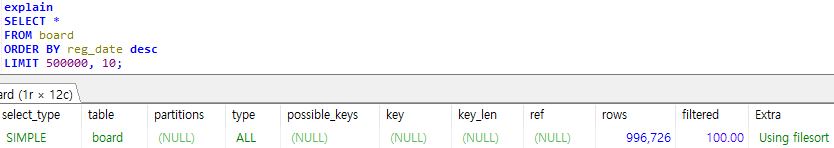

커버링 인덱스란 쿼리의 조건을 충족시키는데 필요한 모든 데이터들을 인덱스에서만 추출할 수 있는 인덱스를 의미합니다.
B-Tree 스캔만으로 원하는 데이터를 가져오기에, 불필요한 데이터의 데이터블록을 읽지 않아서 성능이 좋습니다.
 

가장 많이 사용된 예시로 limit를 이용한 페이징 쿼리를 사용하겠습니다. (데이터 130만건)  

테스트용 테이블
~~~sql
CREATE TABLE IF NOT EXISTS `board` (
  `board_no` bigint NOT NULL AUTO_INCREMENT,
  `title` varchar(50) COLLATE utf8mb4_general_ci NOT NULL,
  `content` varchar(50) COLLATE utf8mb4_general_ci NOT NULL,
  `reg_date` datetime NOT NULL DEFAULT CURRENT_TIMESTAMP,
  PRIMARY KEY (`board_no`)
) ENGINE=InnoDB AUTO_INCREMENT=344094 DEFAULT CHARSET=utf8mb4 COLLATE=utf8mb4_general_ci;
~~~

실행계획을 통해 인덱스 사용 차이를 확인할 수 있다.

> 일반 쿼리

> 커버링 인덱스 쿼리

